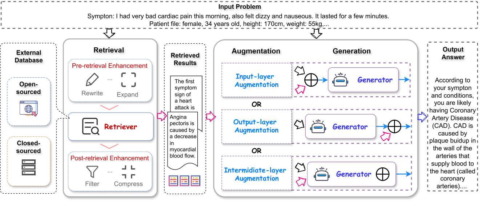

# RAG基础框架
这里我将构建一个最基础的框架，制作这个框架的目的是为了将RAG的各个组件分门别类的区分开，这样方便后续对组件进行更新与创新。
## Setting up:

## 目录结构
```
rag_framework/
├── .git/
├── applications/
│   ├── __init__.py
│   ├── downstream/
│   ├── nlp/
│   └── specific_domains/
├── configs/
│   ├── default_config.yaml
│   ├── generation_config.yaml
│   └── retrieval_config.yaml
├── core/
│   ├── __init__.py
│   ├── generation/
│   │   ├── __init__.py
│   │   └── generators/
│   │       ├── __init__.py
│   │       ├── gpt_generator.py
│   │       └── llama_generator.py
│   ├── integration/
│   │   ├── __init__.py
│   │   ├── input_integrator.py
│   │   ├── middle_integrator.py
│   │   └── output_integrator.py
│   └── retrieval/
│       ├── __init__.py
│       ├── databases/
│       ├── granularity/
│       │   ├── chunk/
|       |   |   ├──fixed_citting.py
|       |   |   └──semantic_cutting.py
│       │   ├── entity/
│       │   └── token/
│       ├── post_retrieval/
│       ├── pre_retrieval/
│       └── retrievers/
│           ├── __init__.py
│           ├── bm25_retriever.py
│           ├── dense_retriever.py
│           └── hybrid_retriever.py
├── docs/
├── examples/
├── main.py
├── README.md
├── tests/
│   ├── test_generation.py
│   ├── test_integration.py
│   └── test_retrieval.py
├── training/
│   ├── __init__.py
│   ├── independent_training/
│   ├── joint_training/
│   ├── no_training/
│   └── sequential_training/
└── utils/
    ├── __init__.py
    ├── emvedding_utils.py
    ├── evaluation_utils.py
    └── logging_utils.py
```
# 各组件功能

框架图来源 https://arxiv.org/pdf/2405.06211 \
在这里我将阐述，核心组件即目录结构中的core部分，一共有三个组成成分，分别是检索部分（其实这一部分包含着RAG的检索与增强部分）、生成部分、结合部分（有关将增强结果与生成器结合的策略）。\
其中检索部分五个重要分支，检索器、检索颗粒度、检索前操作、检索后操作、创建数据库\
检索器（检索方式分类）：有稀疏检索（代表BM25）、密集检索、混合检索\
检索颗粒度：块级分割、令牌级分割、实体分割。现在较为常用的是块级分割（chunk），本项目将对chunk级补充基础功能,chunk中暂时有两种方法，一种是对输入的文档进行固定长切割，一种是对于文档按照语义切割，都切为块存储的返回块，这个块是为了，传给闭源向量数据库。\


    

